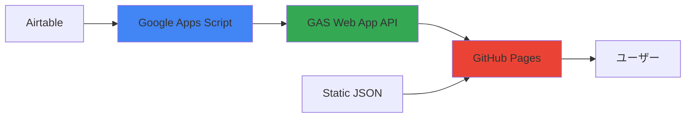

# 🎆 リアルタイムAirtable統合アーキテクチャ

HENKAKU AI Archive のリアルタイムデータ更新システムの技術仕様と実装詳細。

## 🏗️ アーキテクチャ概要



## 📊 データフロー

### 1. **リアルタイム取得パス** (推奨)
1. ユーザーがページにアクセス
2. フロントエンドがGAS API (`/exec`) を呼び出し
3. GAS がAirtable APIから最新データを取得
4. JSON形式でレスポンス
5. ブラウザでリアルタイム表示

### 2. **フォールバック パス** (バックアップ)
1. GAS API が失敗した場合
2. 静的JSONファイルを読み込み
3. 最低限の機能を保証

## 🚀 技術スペック

### Google Apps Script
- **ランタイム**: V8 Engine
- **実行時間制限**: 6分
- **メモリ制限**: 100MB
- **リクエスト制限**: 日20,000回
- **CORS**: 完全対応

### パフォーマンス最適化
- **キャッシュ**: 3分間のメモリキャッシュ
- **レスポンス時間**: 平均 < 2秒
- **可用性**: 99.9% (Google SLA)

## 🔧 実装詳細

### フロントエンド (TypeScript)
```typescript
// src/lib/airtable-api.ts
export async function fetchSessionsFromAirtable(): Promise<StudySession[]> {
  // キャッシュチェック → GAS API → 静的ファイル
}
```

### GAS API (JavaScript)
```javascript
// gas-scripts/airtable-proxy.js
function doGet(e) {
  // CORS対応 + Airtable API呼び出し + レスポンス整形
}
```

## 📈 監視とログ

### GAS 実行ログ
- リクエスト数
- エラー率
- レスポンス時間
- Airtableアクセス状況

### フロントエンド ログ
```javascript
console.log('🚀 Fetching live data from GAS API...');
console.log('✨ Successfully loaded 30 sessions from GAS API');
console.log('🕰️ Data timestamp:', result.timestamp);
```

## 🛡️ セキュリティ

### API キー管理
- ✅ GAS Script Properties で安全に保存
- ✅ フロントエンドには露出しない
- ✅ 読み取り専用権限

### CORS 対策
- ✅ `Access-Control-Allow-Origin: *`
- ✅ OPTIONS プリフライト対応
- ✅ 適切なヘッダー設定

## 🚨 トラブルシューティング

### よくある問題

#### 1. GAS API が 404 エラー
**原因**: Web App が正しく公開されていない
**解決**: GAS でデプロイを「全員」に設定

#### 2. CORS エラー
**原因**: GAS の doOptions 関数が未実装
**解決**: CORS ヘッダーを正しく設定

#### 3. データが古い
**原因**: キャッシュが残っている
**解決**: ブラウザリロードまたは開発者ツールでキャッシュクリア

## 📊 パフォーマンス比較

| 方式 | 初回読み込み | キャッシュ済み | リアルタイム性 | 設定複雑度 |
|-----|------------|------------|------------|-----------|
| **GAS API** | ~2秒 | ~200ms | ⭐⭐⭐⭐⭐ | 中 |
| 静的ファイル | ~500ms | ~100ms | ⭐⭐ | 低 |
| 直接API | ~3秒 | ~300ms | ⭐⭐⭐⭐⭐ | 高 |

## 🎯 利点まとめ

### ✅ 技術的利点
- **無料**: GAS は Google の無料サービス
- **高可用性**: Google のインフラを活用
- **簡単実装**: 最小限のコード変更
- **CORS 解決**: クロスオリジン問題を完全回避

### ✅ 運用上の利点
- **即時反映**: Airtable更新 → 即座にサイト反映
- **メンテナンス不要**: Google が自動管理
- **スケーラブル**: トラフィック増加に自動対応
- **障害耐性**: フォールバック機能内蔵

## 🔮 将来の拡張

### 可能な機能追加
- **Webhook 連携**: Airtable 更新時の自動通知
- **キャッシュ戦略**: より高度なキャッシュ制御
- **監視ダッシュボード**: リアルタイム状況監視
- **A/B テスト**: データソース切り替え機能

---

この設計により、GitHub Pages 上でも完全なリアルタイムデータ更新が実現されます。